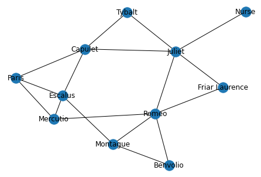

```
import networkx as nx
import matplotlib.pyplot as plt
import operator
import random

practice_graph = nx.Graph()

def draw_practice_graph():
    """Draw practice_graph to the screen."""
    nx.draw(practice_graph, with_labels = True)
    plt.show()

practice_graph.add_node("Romeo")
practice_graph.add_node("Benvolio")
practice_graph.add_node("Montague")
practice_graph.add_node("Mercutio")
practice_graph.add_node("Paris")
practice_graph.add_node("Escalus")
practice_graph.add_node("Capulet")
practice_graph.add_node("Juliet")
practice_graph.add_node("Nurse")
practice_graph.add_node("Tybalt")
practice_graph.add_node("Friar Laurence")

practice_graph.add_edge("Romeo", "Juliet")
practice_graph.add_edge("Romeo", "Friar Laurence")
practice_graph.add_edge("Romeo", "Benvolio")
practice_graph.add_edge("Romeo", "Montague")
practice_graph.add_edge("Romeo", "Mercutio")

practice_graph.add_edge("Romeo", "Mercutio")
practice_graph.add_edge("Juliet", "Tybalt")
practice_graph.add_edge("Juliet", "Nurse")
practice_graph.add_edge("Juliet", "Capulet")
practice_graph.add_edge("Juliet", "Friar Laurence")

practice_graph.add_edge("Escalus", "Paris")
practice_graph.add_edge("Escalus", "Capulet")
practice_graph.add_edge("Escalus", "Mercutio")
practice_graph.add_edge("Escalus", "Montague")

practice_graph.add_edge("Paris", "Capulet")
practice_graph.add_edge("Paris", "Mercutio")

practice_graph.add_edge("Capulet", "Tybalt")
practice_graph.add_edge("Capulet", "Juliet")
practice_graph.add_edge("Capulet", "Juliet")

practice_graph.add_edge("Benvolio", "Montague")
```


```
draw_practice_graph()
```


    

    


```

```
